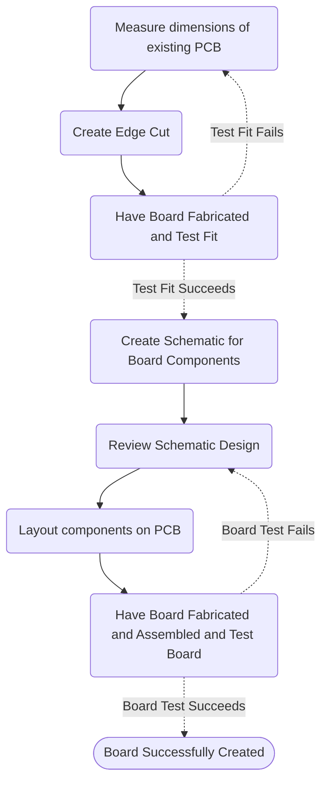

Using my experience creating a drop in replacement board for the PXN X9 to provide an example of the process of making one's own custom RP2040 based board and using it with GP2040-CE firmware.

<!-- truncate-->

## General PCB Creation Process

This is the general process for creating a PCB to replace an existing board.

